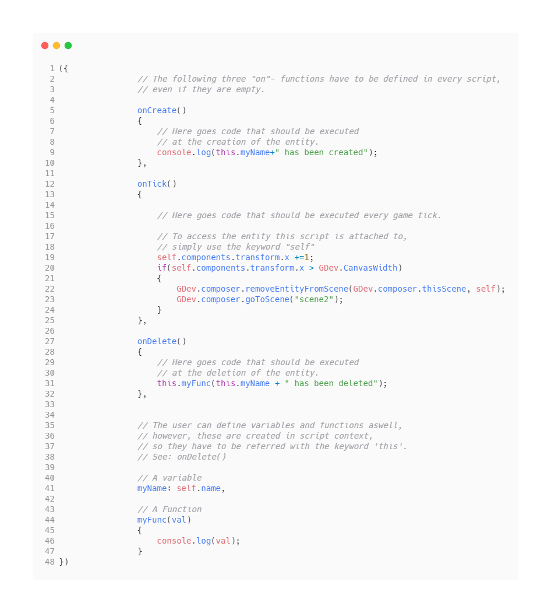

# GDev
GDev is an easy to use, component based game editor based on the simple yet powerfull Javascript game framework [jBB](https://github.com/Farbfinsternis/jBB
).

 

## GDev consists of three sub projects:
- The GDev Engine (in a usable state, yet incomplete)
- The Editor (not usable yet)
- The Transpiler (not usable yet)

## The toolchain

 

- In the editor you can set up scenes and add entites.
- In the code editor you write scripts for your scenes and entites in json/javascript syntax

A script file could look like follows:

 

