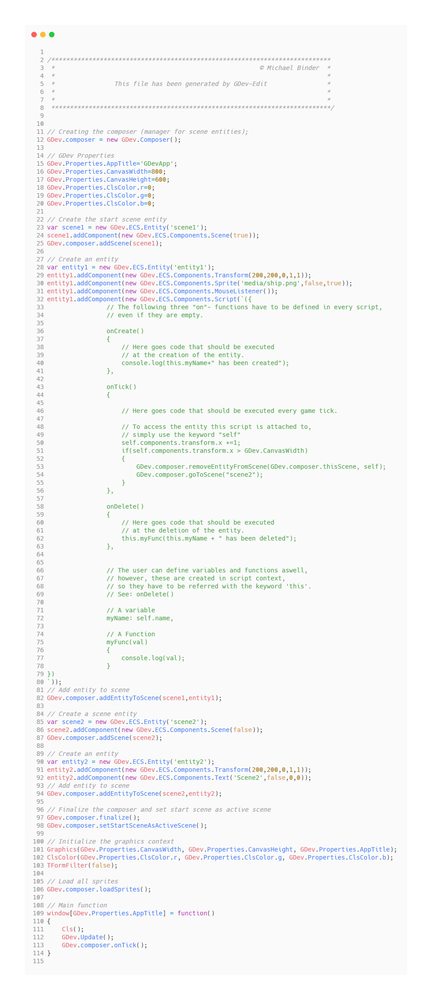

# GDev

## What is GDev?
GDev is an easy to use, component based game engine based on the simple yet powerfull Javascript game framework [jBB](https://github.com/Farbfinsternis/jBB).
GDev comes bundled with GDev-Edit - an editor allowing you to quickly set up your scenes and objects. With the build-in code-editor, you can create scripts in a Javascript/JSON-like syntax and attach them to scenes and objects.

 

## GDev consists of three sub projects:
- GDev-Engine (in a usable state, yet incomplete)
- GDev-Edit the editor (not usable yet)
- The Transpiler (working)

## The toolchain

 

- In the editor you can set up scenes and add entites.
- In the code editor you can write scripts for your scenes and entites in a json/javascript syntax

A script file could look like as follows:

 

## The Transpiler

The transpiler takes a gdp-file (GDev-Edit project file) as input and transpiles it into a game.js, ready to be included into an html file.

The gdp-file can look something like this:

 

and the transpiler creates a game file out of it:

 

